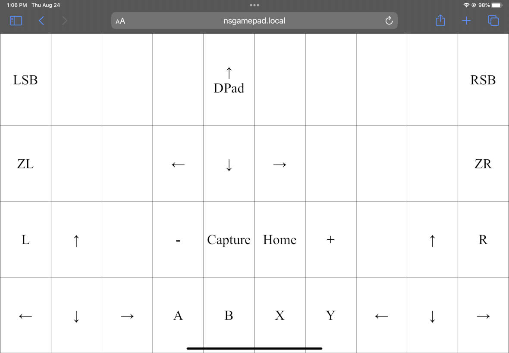
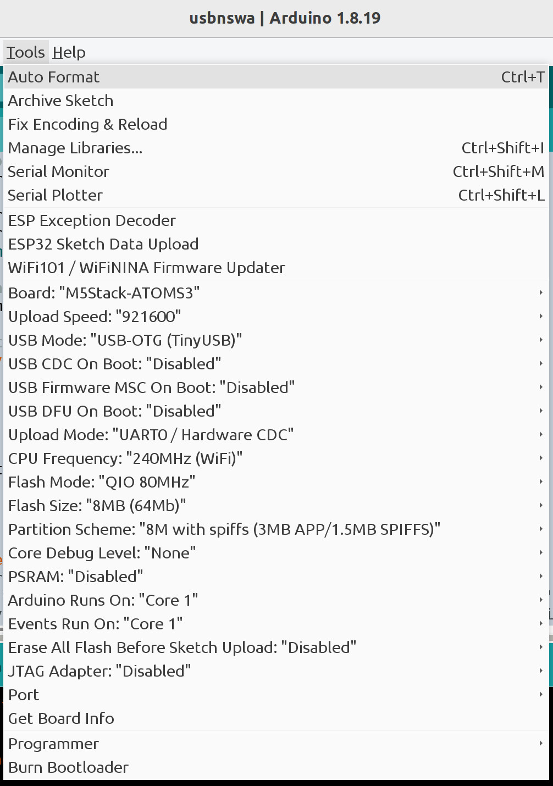

# USBNSWA -- USB Nintendo Switch Web App


USBNSWA (USB Nintendo Switch Web App) turns a large tablet or any device with a
Web browser into a USB Nintendo Switch gamepad. Anyone having difficulties
using joycons or a regular gamepad may find a touchscreen gamepad easier to
use.




The gamepad web app displays a 4x10 grid in the browser window. The locations
of touch or mouse events are sent via a web socket back to the ESP32 S3 web
server. The server translates locations to USB HID gamepad reports and sends
them out to the USB HID gamepad interface to the Nintendo Switch.

The M5Stack AtomS3 ESP32-S3 board is programmed using the Arduino IDE. The
AtomS3 comes with a plastic case so 3D printing is not needed. No soldering is
required. The web browser communicates to the ESP32 using WiFi. The ESP32-S3
communicates with the Nintendo Switch using USB HID.

## Hardware


The M5Stack AtomS3 contains an ESP32-S3 chip made by Espressif with a small
color display. The display is also a button!


The AtomS3 Lite version does not include a display. The front is a button. There is
one RGB LED inside.

Both have small buttons on the side. Pressing and holding the side button for
about 2 seconds, activates the bootloader. When the bootloader is active, an
LED inside turns green.

## Software

* [Arduino IDE 1.8.19](https://www.arduino.cc/en/software)
* [Arduino ESP32 Getting Started](https://docs.espressif.com/projects/arduino-esp32/en/latest/getting_started.html)

The following libraries can be installed using the IDE Library Manager.

* [WebSockets by Markus Sattler](https://github.com/Links2004/arduinoWebSockets)
* [ArduinoJson by Benoit Blanchon](https://arduinojson.org/)
* [WiFiManager by tablatronix](https://github.com/tzapu/WiFiManager)
* [OneButton by Mattias Hertel](https://github.com/mathertel/OneButton)
* [FastLED by Daniel Garcia](https://github.com/FastLED/FastLED)
* [M5GFX by M5Stack](https://github.com/m5stack/M5GFX)

Install this library by downloading the ZIP file then install it use the
IDE "Add .ZIP library".

* [Nintendo Switch USB gamepad for ESP32](https://github.com/esp32beans/switch_ESP32/archive/refs/heads/main.zip)

The following picture shows the AtomS3 options to build USBNSWA.



The most reliable way to upload is to double click the small button on the side
of the AtomS3 to put it in bootloader mode. After the upload finishes, press
the same button once to reset the AtomS3 so it start running the code.

Another option is to use the Over-the-Air (OTA) option but this only works
after configuring the WiFi router name and password.

If you want USB serial debug output, in usbnswa.ino set DEBUG_ON to 1. Then
change the IDE ESP32 board options as follows. Set "USB Mode" to "USB-OTG
(TinyUSB)" and "USB CDC On Boot" to "Enabled".

## Compiler Warnings

Ignore the warning messages about "WM_NOTEMP" and "No hardware SPI pins defined".

## Display Messages

### "Connect to NSGamepad with phone"

USBNSWA must be configured with WiFi router name and password (also known
as SSID and PSK if you prefer tech jargon). Use a phone or table to connect to
the WiFi Access Point named "NSGamepad". There is no password. A window should
open to enter your WiFi router name and password.

### "WiFi Password Erased"

The WiFi router name and password can be erased by triple clicking on the
AtomS3 display.  On the Lite version, the top is a button. This useful if you
want to use a different WiFi router or the password is wrong.

### "WiFi Connecting"

USBNSWA is connecting to your WiFi router.

### "WiFi failed to connect"

USBNSWA is unable to connect to any WiFi router. For example, if the wrong WiFi
password is entered. Triple clicking the AtomS3 display or the Lite front button
will erase the WiFi password.

### "nsgamepad.local or www.xxx.yyy.zzz"

USBNSWA is connected to your WiFi router and is open for business. Open a web
browser to USBNSWA by entering "http://nsgamepad.local" in the address window.
If this does not work, try "www.xxx.yyy.zzz".  The values of www, xxx, yyy, and
zzz will vary depending on your WiFi router.

## Other Features

### Co-Pilot

More than one tablet or computer may be connected to USBNSWA at the same time.

### Keyboard Input (Experimental)

Web browser keyboard input is useful if using a laptop or desktop without a
touchscreen. So far WASD for left stick movement and keyboard arrow keys for
right stick movement are supported.

The keyboard input code is in index_html.h.
```C
const KeyCodes = {
 "ArrowUp": NS_Control.RightStickUp,
 "ArrowDown": NS_Control.RightStickDown,
 "ArrowLeft": NS_Control.RightStickLeft,
 "ArrowRight": NS_Control.RightStickRight,
 "KeyW": NS_Control.LeftStickUp,
 "KeyS": NS_Control.LeftStickDown,
 "KeyA": NS_Control.LeftStickLeft,
 "KeyD": NS_Control.LeftStickRight,
};

document.addEventListener('keydown', function(event) {
  console.log(event);
  if (!event.repeat && event.code in KeyCodes) {
    websock.send(JSON.stringify({event:'keydown', code:KeyCodes[event.code]}));
  }
}, false);

document.addEventListener('keyup', function(event) {
  console.log(event);
  if (event.code in KeyCodes) {
    websock.send(JSON.stringify({event:'keyup', code:KeyCodes[event.code]}));
  }
}, false);
```

## Related Project

[USBKWA](https://github.com/touchgadget/usbkwa) USB keyboard Web App is similar
but for USB keyboard instead of USB gamepad. This may be useful as a general
purpose keyboard or for PC gaming. USBKWA works with various ESP32-S3 boards
without displays.
